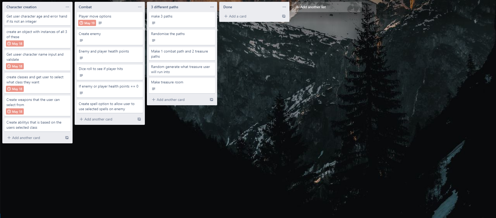
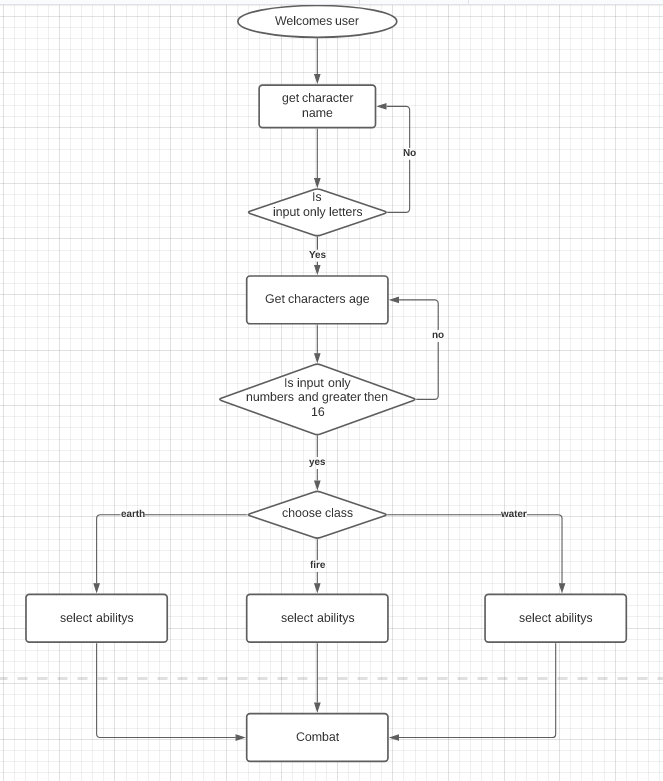
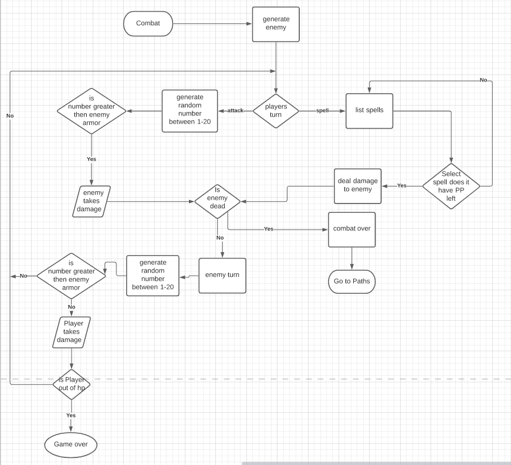
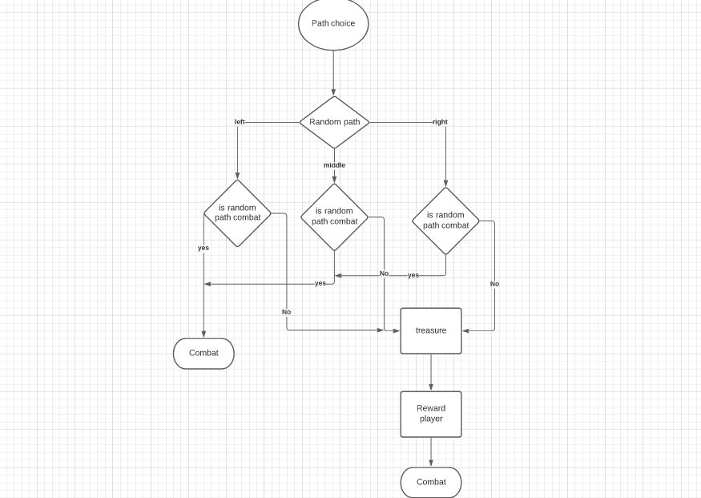

# Terminal App

# Installation

To download the application you can either clone it or download to a zip file and extract into a loction of your choosing from my github Repo that you can find [here](https://github.com/jkirky82/Terminal-App)

To run the application you will need to have ruby installed and the needed gem files. The gem should automaticly install on your computer from the gemfile that you will download from the Repo.

After installing Ruby and cloning the Repo head to the file 

Change to the directory that contains the repository.

        cd {JackKirkwood}_T1A3/src

Type this code into the terminal to start the application.

        ./run_app.sh

Once at this directory in the terminal run this command "./run_app.sh". If any issues occur with the installed gems, all gems used can be found in the gemfile and respected versions. 

# Software Development Plan

## What Will the Application Do

The application is a turned base RPG were you go around fighting monsters finding treasure and fighting more monsters.
The application will allow you to create your on character with user input and class selection, that will allow you to select abilitys based on the class you pick.

It will loop through combat with a random generated enemy and go through till either the player or the enemy's health is 0. You will have different options to fight the enemy with.

After combat different paths will come up that are randomly generated, these could either take you to treasure or to more combat. After a treasure path you will go back to another combat.

After beating 5 enemys that progressively get harder you win the game.

## Identify the problem it will solve and explain why you are developing it

This application is made for entertainment to fix bordem, the game can be played on any computer as it doesnt take much processing power to run at all.

## Identify the target audience

The target audience is people who like to play games and friends. Since its a game an obvious answer is someone that enjoys playing games or friends that I want to display my game to.

## Explain how a member of the target audience will use it

The user will need a computer to run the application. The game is run on a terminal which comes built in to every computer, although the user will need to install a couple of different parts for their terminal. The user will need ruby which is the programming language that the code is written in, they also need to install a gems that will be sent to them in a list.

# Features

## Character Creation  

When the program starts the user will create their character, they will have to enter a name and age, these will be check to make sure the name only has letters and the age is only number, if they arent it will ask to reinput.
The user will also choose a class out of three options, these will have there own abilitys that the user can select from. The abilitys will have different damage amounts and amount of uses, the uses can be restored in some places of the game.

## Combat

The will have to do multible combats throught the game. The combat will be you vs one other enemy, you will get an attack on the enemy using either a weapon or one of the selected spells from the character creation. After your turn the enemy will get an attack at you. The first to go below 0 health points loses and if its you the game is over. Each level the enemys get harder and harder to beat, having more health and hitting harder.

## Inbetween Combate

In-between combats the user will be asked what directions they would like to go, this is either left,middle or right. Each direction will either lead to combat or treasure, this will be randomised so its different every playthrough. Combat will just go to the next level, while treasure will take you to treasure. There are 3 different types of treasure, resting place, pp potion and a special path that will lead you to a troll where you could get some special treasure or fight a super hard fight that only the best can beat.

# How to use

The Game will have very easy to follow prompts for the character selection that will output a message when the user has incorrectly inputed something.
A quick overview/descriotion will display of each of the different combate option: attack, abilites, potions. They will also be in tty prompt to make the code less typed user input so there are less errors through the program.

### How the user will interact

As said before the user will you predominantly use tty prompt for less user input errors and error checking, the user will still have to use text based input in the character creation and when inputing or saving a file.

### How errors will be handled by the application and displayed to the user

When user has to type input ever input will have to be check that it is the correct datat type by putting it a number validation or a string validation. If the input is incorrect the user will be notted that it is incorrect and  will prompt for a re input of the number or string and whill continue this loop untill it has been inputed correctly.

# Trello

# Diagrams

These flow charts the 3 stated features and how they will flow

